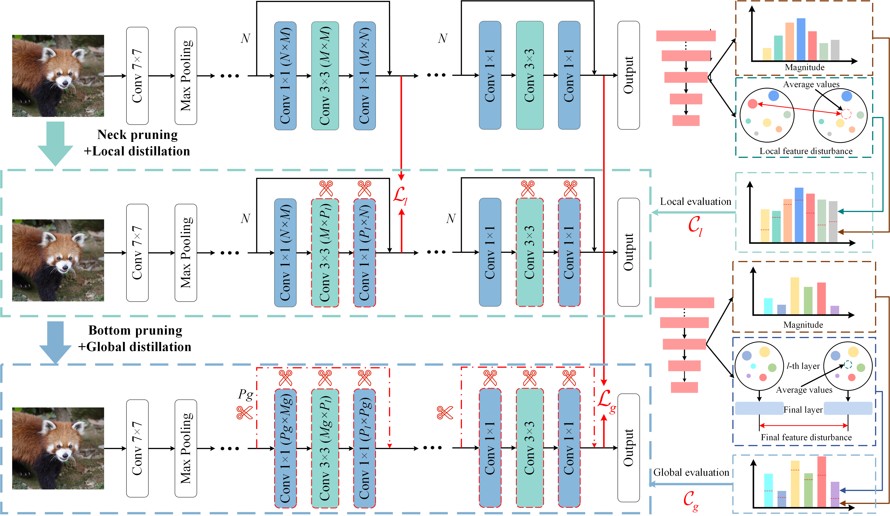

# Data-efficient Model Compression via Alternating Pruning and Distillation
## This repository is official implementation of Data-efficient Model Compression via Alternating Pruning and Distillation.


## Framework
<p align="center">

</p>

## Usage
### Requirements

* Python3
* pytorch 1.11.0
* thop
* torch_pruning

### Prepare Data
DownLoad the ImageNet-1k dataset

## Running the code

### Compressing 50% FLOPs of ResNet-34 model in few-shot settings (500 samples).
```shell
python main.py \
--dataset imagenet_fewshot \
--seed 2021 \
--lr 0.01 \
--num_sample 500 \
--epochs 1000 \
--train_batch_size 256 \
--eval_batch_size 256 \
--local_prune_ratio 0.45 \
--global_prune_ratio 0.1 \
--local_imptype Local_Disturb \
--global_imptype GLobal_Disturb \
--data_dir /lab310/classify/imagenet/ \
--job_dir ./result/resnet34/GradualTrim \
--arch resnet34 \
--gpu 6
```

### Compressing 50% FLOPs of ResNet-34 model in data-free settings (synthetic iamges generated by ADI).
```shell
python main.py \
--dataset synthetic_imagenet \
--seed 2021 \
--lr 0.01 \
--train_data_dir /lab310/classify/imagenet_syn/ \
--epochs 50 \
--train_batch_size 256 \
--eval_batch_size 256 \
--local_prune_ratio 0.45 \
--global_prune_ratio 0.1 \
--local_imptype Local_Disturb \
--global_imptype GLobal_Disturb \
--data_dir /lab310/classify/imagenet/ \
--job_dir ./result/resnet34/GradualTrim \
--arch resnet34 \
--gpu 6
```

### Compressing 44% FLOPs of VGG-16 model in few-shot settings (500 samples).
```shell
python main.py \
--dataset imagenet_fewshot \
--seed 2021 \
--lr 0.01 \
--num_sample 500 \
--epochs 6000 \
--train_batch_size 32 \
--eval_batch_size 32 \
--local_prune_ratio 0.45 \
--global_prune_ratio 0.15 \
--local_imptype Local_Disturb \
--global_imptype GLobal_Disturb \
--data_dir /lab310/classify/imagenet/ \
--job_dir ./result/vgg16/GradualTrim \
--arch vgg16 \
--gpu 4
```

### Compressing 44% FLOPs of VGG-16 model in data-free settings (synthetic iamges generated by ADI).
```shell
python main.py \
--dataset imagenet_fewshot \
--seed 2021 \
--lr 0.01 \
--train_data_dir /lab310/classify/imagenet_syn/ \
--num_sample 500 \
--epochs 6000 \
--train_batch_size 32 \
--eval_batch_size 32 \
--local_prune_ratio 0.45 \
--global_prune_ratio 0.15 \
--local_imptype Local_Disturb \
--global_imptype GLobal_Disturb \
--data_dir /lab310/classify/imagenet/ \
--job_dir ./result/vgg16/GradualTrim \
--arch vgg16 \
--gpu 4
```


